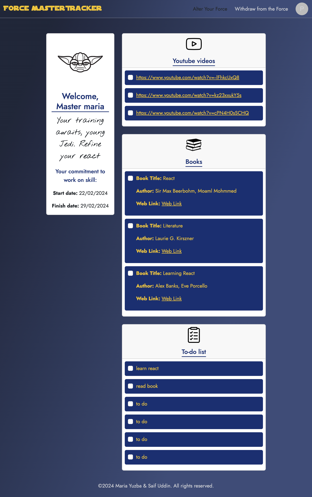
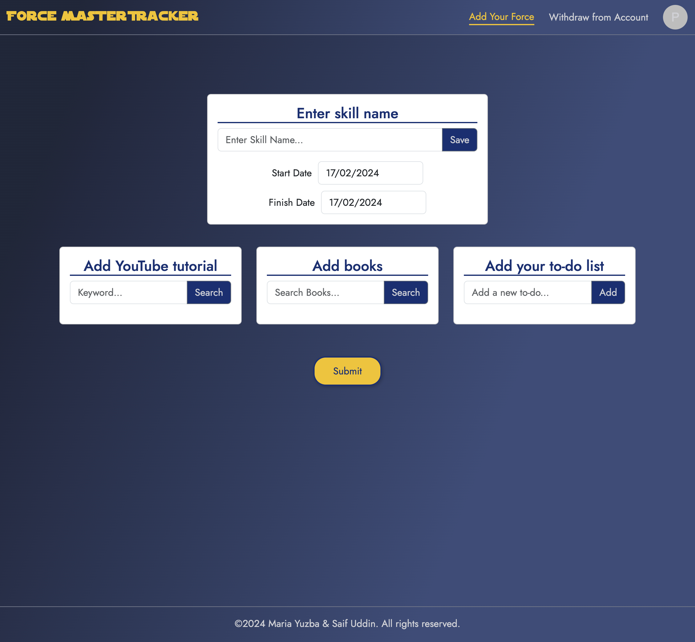

# Skills Development Tracker App 

## Table of Contents
1. [Description](#description)
2. [Features](#features)
3. [Motivation](#motivation)
4. [Technologies](#technologies)
5. [Collaboration](#collaboration )
5. [Resources](#resources)
7. [License](#license)

## Description

As we reached week 13, we had our second project from EdX bootcamp where we collaborated and created a solution that integrated data from several server-side API requests to solve a real-world problem.

In our second project as a team, we began from the ideation stage, created wireframes, and then implemented functionality. We adhered to agile management practices and actively used Trello for project management.
This allowed us to effectively distribute the tasks within the team, stick to deadlines and create an MVP within a relatively short time frame. We managed to successfully work on different features and fix bugs by using git branch workflow and pull request system.

The final result is the app that assists a user in tracking the progress of gaining a particular skill. The user can create a card for a particular skill where they can: 
- add a skill name,
- start and finish dates,
- get a YouTube tutorial (by getting data from YouTube API),
- add a book relative to the topic (by getting data from Open Library,
- add some tasks to reach the required skill level (to-do list).

## Features:
- Creates a skill card with the to-do list.
- Allows to add Youtube links to the to-do list by typing in a keyword and selecting the necessary videos.
- Allows to add books' links to the to-do list by typing in a keyword and selecting the necessary books by title.
- Visualizes all the skills that you are working on. 

## Future Enhancements:

- Add statistics on:
  - how many days has the user spent on a particular skill;
  - which days and hours were the most active;
    
- Add functionality to be able to edit each Skill card that is already created (add/remove to-do list items, change dates). 

## Motivation:
- As keen learners, we thought that it would be helpful for us and like-minded people to have some management in relation to developing different skills where we can track the progress, and see/compare the results, which can eventually optimise our time.

## User story:
- AS the learner 

- I WANT to be able to log in the key data for each new skill I'd like to develop

- SO THAT to track the progress, see/compare the results and optimise my time in achieving the required skill level.

## Technologies:

- Node.js;
- React;
- APIs:
  - [YouTube API](https://developers.google.com/youtube)
  - [Open Library API](https://openlibrary.org/)
- Libraries:
  - [Date Picker](https://reactdatepicker.com/)
  - [MUI](https://mui.com/)
- Git/Github: Repo and version management.
- Bootstrap React: For most of the CSS styling.
- Netlify: for deployment.

## Collaboration 

**Challenges and Successes**

**Saif**

Challenges:
- Learning React has been the biggest learning curve yet in this Bootcamp which I had little knowledge when starting this project.
- Effectively rendering React components using the Array.map function.

Successes:
- Learning how to use React components, states and hooks/custom hooks.
- Being able to deploy a working application to Netlify.

**Maria**

Challenges:
- I took some time to get used to working with REACT as it is based on what I've learnt before, but at the same time, it's different.  

Successes:
- Accomplishing the integration of Youtube API and created a list of Youtube links and titles, that are added with a checkbox which can be selected by the user and added to the to-do list of a particular skill. Save those links to local storage for further rendering. 
- Understanding how to work and create React app (how to structure an app in terms of combining components, using states, routes, how to style).

**Breakdown of tasks and roles**

**Saif:** 
- Main focus working on JS functionality.
- Split up React components and pages to work on.
- Used Material UI for SignIn & SignUp pages
- Used Bootstrap and custom css

**Maria:**
- Mostly worked on Create SKill and Created Skill pages (apart from Books api), Calendar component, bits of Navbar, Footer.
- Utilised Youtube API to add videos to the to-do list.
- Created the Skill Name section with the start and finish dates.
- Created the To-do list component.
- Used Date picker for the Calendar component and Bootstrap React for styling.

## Screenshots of the application

## Resources

**1. A link to the deployed application: https://skillsdevelopment.netlify.app/**

**2. GitHub Repo: https://github.com/yuzbamaria/skills-tracker**

## Installation 
To be able to use this MVP version, please sign up first (click on the Sign In in the navbar, then under the Sign in form, click on Sign up).

## License 
MIT License
